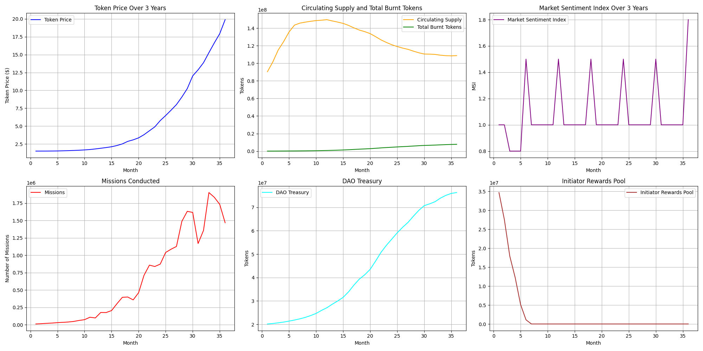
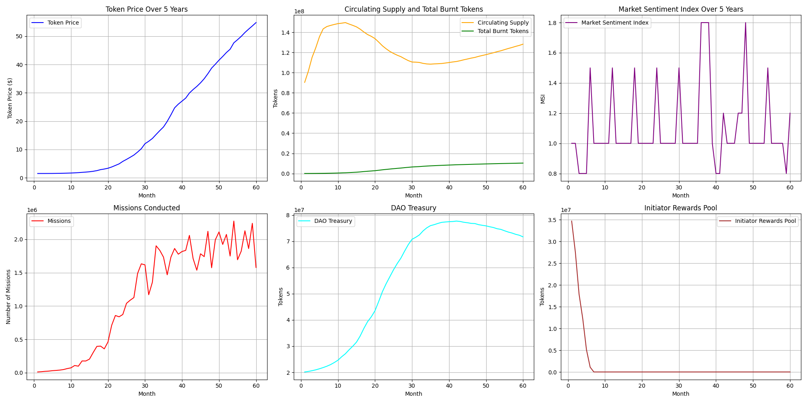
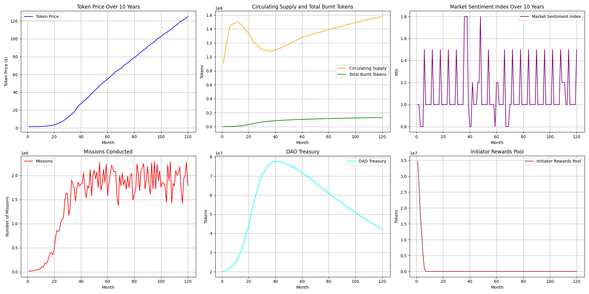

# PoLN Tokenomics Simulation

[](https://github.com/fairhive-labs/tokenomics-simulation/actions/workflows/ci.yml)

A Monte Carlo simulation of the **$POLN** token economy. Models token price dynamics, circulating supply, burn mechanics, staking, mission growth, DAO treasury flows, vesting schedules, and market sentiment over configurable time horizons (3, 5, 10 years).

## How It Works

The simulation runs a month-by-month loop that:

1. **Generates missions** using logistic growth with seasonal adjustments and random fluctuations
2. **Processes protocol fees** — staking, burning (on failed missions), and distributing to fellowship members
3. **Vests tokens** across builders, private sale investors, testnet partners, and initiator rewards (with halving)
4. **Adjusts token price** based on net demand/supply ratio, market sentiment (bull/bear/normal), and roadmap milestones
5. **Tracks DAO treasury** consumption over time

All parameters are defined in `config.json`. Each run produces CSV data and plots in `results/`.

## Installation

```bash
git clone https://github.com/fairhive-labs/tokenomics-simulation.git
cd tokenomics-simulation
python -m venv venv
source venv/bin/activate  # Windows: venv\Scripts\activate
pip install -r requirements.txt
```

### Requirements

| Package | Version |
|---|---|
| contourpy | 1.3.3 |
| cycler | 0.12.1 |
| fonttools | 4.62.1 |
| kiwisolver | 1.5.0 |
| matplotlib | 3.10.8 |
| numpy | 2.4.4 |
| packaging | 26.0 |
| pandas | 3.0.2 |
| pillow | 12.2.0 |
| pyparsing | 3.3.2 |
| python-dateutil | 2.9.0.post0 |
| pytz | 2026.1.post1 |
| six | 1.17.0 |
| tzdata | 2026.1 |

## Usage

### Configure

Edit `config.json` to adjust simulation parameters (see [Parameters](#parameters) below).

### Run

```bash
python main.py
```

### Results

Output goes to `results/`:
- `simulation_data_{N}yrs.csv` — monthly data for each time horizon
- `simulation_{N}yrs.png` — 6-panel plot (token price, supply & burn, market sentiment, missions, DAO treasury, initiator rewards)

## Sample Output

### 3-Year Simulation



Short-term view showing early mission growth ramp-up, initial token vesting effects, and price discovery phase.

### 5-Year Simulation



Mid-term view capturing the full logistic growth S-curve, reward halving events, and DAO treasury drawdown kicking in.

### 10-Year Simulation



Long-term view showing mission saturation at carrying capacity, circulating supply stabilization, cumulative burn impact, and sustained market sentiment cycles.

## Parameters

All parameters live in [`config.json`](config.json).

### Core Economics

| Parameter | Key | Description |
|---|---|---|
| Total Supply | `total_supply` | Total number of $POLN tokens (200M) |
| Initial Price | `initial_price` | Starting token price in USD |
| Project Cost | `project_cost` | Average mission cost in USD |
| Protocol Fee Rate | `protocol_fee_rate` | Fee percentage charged per mission |
| Staking Rate | `staking_rate` | Fraction of protocol fee staked in $POLN |
| Mission Success Rate | `mission_success_rate` | Probability a mission succeeds |
| Price Elasticity | `pec` | Sensitivity of price to demand/supply ratio changes |
| Random Seed | `random_seed` | Optional integer for reproducible runs. Set to `null` for a nondeterministic (fresh-random) run each time. |

### Market Sentiment

| Parameter | Key | Description |
|---|---|---|
| Bull / Bear / Normal MSI | `msi_bull`, `msi_bear`, `msi_normal` | Sentiment multipliers |
| Bull / Bear Probability | `bull_market_probability`, `bear_market_probability` | Monthly event probability |
| Event Duration | `market_event_duration` | How long market events last (months) |
| Roadmap Effect | `roadmap_effect` | MSI multiplier at roadmap milestones |
| Roadmap Cycle | `roadmap_cycle` | Milestone interval (months) |
| Random Fluctuation | `random_fluctuation` | Mission count noise magnitude |

### Mission Growth

| Parameter | Key | Description |
|---|---|---|
| Carrying Capacity | `carrying_capacity` | Maximum achievable missions |
| Growth Rate | `growth_rate` | Logistic growth speed |
| Inflection Point | `inflection_point` | Month when growth shifts from accelerating to decelerating |
| Seasonality | `seasonality` | Monthly adjustment factors (1-12) |

### Token Distribution

| Parameter | Key | Description |
|---|---|---|
| Distribution | `token_distribution` | Allocation across groups (Public Sales 30%, Initiator Rewards 20%, Private Sales 25%, Builders 10%, DAO Treasury 10%, Testnet 2%, Airdrops 3%) |
| Builders Lockup | `builders_lockup_period` | Months before builders can vest |
| Builders Vesting | `builders_vesting_period` | Linear vesting duration (months) |
| Builders Selling % | `builders_selling_percentage` | Fraction of vested tokens sold monthly |
| Testnet Distribution | `testnet_distribution_period` | Distribution period (years) |
| Initiator Selling % | `initiator_selling_percentage` | Fraction of rewards sold monthly |

### DAO

| Parameter | Key | Description |
|---|---|---|
| Annual Consumption Rate | `dao_annual_consumption_rate` | Yearly treasury drawdown rate |
| Consumption Start | `dao_consumption_start_month` | Month DAO begins spending |
| Fellowship Selling % | `fellowship_selling_percentage` | Fraction of fee distributions sold |

### Private Sales

Array of sale rounds with `tokens_sold`, `price`, and `vesting_period` (months). Example:

```json
[
    {"tokens_sold": 20000000, "price": 0.10, "vesting_period": 12},
    {"tokens_sold": 15000000, "price": 0.20, "vesting_period": 6},
    {"tokens_sold": 15000000, "price": 1.00, "vesting_period": 0}
]
```

### Initiator Rewards

Tiered reward structure with halving mechanics. Initial rewards per mission type:

```json
{"daily": 8.00, "weekly": 64.00, "monthly": 512.00, "quarterly": 4096.00, "half_yearly": 32768.00}
```

Rewards halve as the pool depletes, with a floor at `minimum_reward_per_mission` (1e-18).

## Development

Install the runtime and tooling dependencies, then run the quality gate:

```bash
pip install -r requirements-dev.txt

pytest                       # unit tests + coverage (fails under 90%)
pylint simulation.py main.py # lint
bandit -r simulation.py main.py  # security scan
```

The same checks run in CI (`.github/workflows/ci.yml`) on Python 3.11 and 3.12.
The simulation is deterministic under a fixed `random_seed`, so tests assert
exact reproducibility. Runs are driven by `numpy`'s `Generator` (seedable and
free of the insecure-PRNG static-analysis warning).

## Notes on Model Corrections

This release corrects a few modelling issues from earlier versions:

- **Testnet vesting** now releases a fixed linear tranche computed from the
  initial allocation, so testnet tokens fully distribute over their window
  (previously the tranche was recomputed on the shrinking balance, decaying
  exponentially and never fully vesting).
- **Reward halving** is evaluated every month rather than only in months with
  missions.
- **Private-sale accounting** is consistent between supply-clamping steps
  (zero-vesting rounds are counted as liquid once, not double-counted).

Because of these fixes and seed-based determinism, numeric outputs differ from
pre-1.0 runs.

## Disclaimer

This simulation is a modeling tool for exploring PoLN tokenomics scenarios. Results are estimates based on configurable assumptions and stochastic processes — they should not be used as the sole basis for financial decisions.

## Contributing

1. Fork the repo
2. Create a feature branch (`git checkout -b feature/your-feature`)
3. Commit and push your changes
4. Open a Pull Request

## License

[MIT](LICENSE) - fairhive-labs

## Contact

Questions or issues? [Open an issue](https://github.com/fairhive-labs/tokenomics-simulation/issues) or email <contact@poln.org>.
